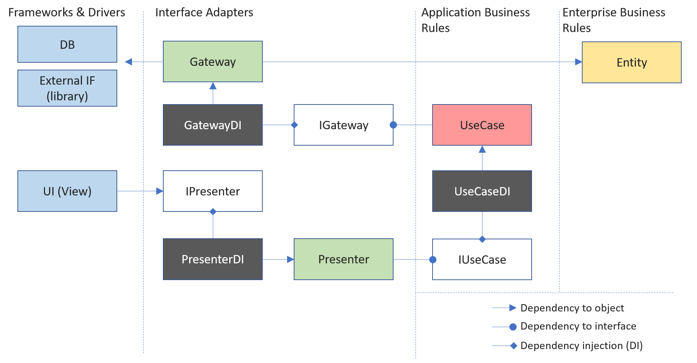
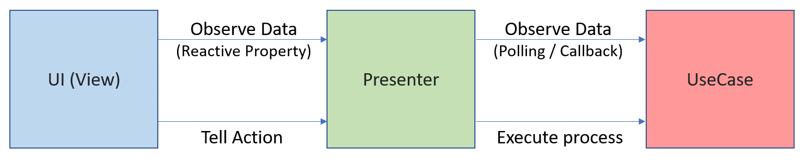

# Simple Clean Architecture Example for Unity

This is an example project of Unity GameEngine to explain the concept of "Simple Clean Architecture".  
This example is the simplest implementation to show how SCA design pattern looks. This example doesn't include any 3rd party libraries.  
If you apply the concept of SCA to your real project, you may need 3rd parties library to support this design pattern for such as Dependency Injection, Reactive Programming. In that case, please have a look at [this project](https://github.com/genki-tx/UnitySimpleCleanArchitecture) instead.  

## Simple Clean Architecture?
Simple Clean Architecture (SCA) is a software architecture based on the concept of [Clean Architecture](https://blog.cleancoder.com/uncle-bob/2012/08/13/the-clean-architecture.html).
Clean Architecture provides great concept to keep our software clean and less coupled. However, if you make software by the strict guideline of Clean Architecture, your software project structure may be a bit redundant. (e.g., using Repository, Use input port, Data Access, ... to access data)  
SCA is simplified and ready-to-implement design pattern of Clean Architecture. You can see the similarity with MVP, MVVM design patterns. In SCA, we have 5 components (Entity, Gateway, Usecase, Presenter, View) defined in Clean Architecture. Each component should be less coupled and managed by Dependency Injection(DI). We also use Reactive Programming design pattern to communicate each component within less coupled dependency.  
For the detail of Simple Clean Architecture, please refer [this article](https://genki-sano.medium.com/simple-clean-architecture-762b90e58d91).

## Components  
SCA provides you good advantages if your Unity project has a huge codebase. We classify your code logic into 5 groups (Entity, Gateway, Usecase, Presenter, View). Let's see each role.  
- Entity  
  - Entity is responsible for encapsulating the most basic business rules, including primitive objects and methods.
  - Entity can't inherit MonoBehaviour
  - Entity can't depend on Usecase, Gateway, Presenter, View

- Usecase 
  - Usecase can depend on Gateway through its interface.
  - Usecase can’t be dependent on View, Presenter
  - Usecase can’t inherit MonoBehaviour
  - Usecase may depend on other Usecase through its interface (but try to avoid as much as possible)

- Gateway
  - Gateway can't inherit MonoBehaviour
  - Gateway can't depend on View, Presenter, Usecase
  - Gateway may rely on other Gateways through interfaces (but try to avoid as much as possible)

- Presenter
  - Presenter can depend on Usecase through its interface
  - Presenter can’t dependent on View, Gateway
  - Presenter can inherit MonoBehaviour
  - Presenter may rely on other presenters through its interface (but try to avoid as much as possible)

- View
  - View can depend on the Presenter through its interface
  - View can’t depend on another View.
  - View can't depend on Usecase, Gateway
  - View can inherit MonoBehaviour

This diagram shows each component's relationship.

## Dependency Injection  
If you make a loosely coupled software, you need to consider "how to resolve the dependency," meaning who will create the instance.  
Dependency Injection is a concept for this. In this example, we are using "Service Locator Design Pattern". A class is in charge of creating instances, and each component can access it by static method to resolve the dependency to other components. You can see the implementation in `Assets/Scripts/CounterDI.cs` for example.

## Reactive Programming  
In SCA, we use the concept of Reactive Programming to have each component communicate with each other. This approach can reverse the direction of dependency. In general (without SCA), internal logic pushes internal data to change to UI to update it. In that case, the internal logic class needs to know the UI class (dependency from inside to outside, or bidirectional dependency). This usual approach increases the coupling between classes. To solve this, we use reactive programing to have UI subscribe the internal logic from outside so that we can keep the direction of the dependency. The following diagram shows the flow of data.  

In this example, we use EventHandler in C# not to use 3rd party library. However, you may need a more intelligent reactive programming approach to handle complicated logic. Please have a look at [this project] in that case.  

## Example Scene  
Open this project by Unity. Example scene is `Assets/Scenes/SampleScene.unity`. Example scene contains UI with 2 buttons. It is a simple application, but it has all the components of SCA.  
Some of the View components are attached to Button and Text. View resolves its dependency by `PresenterDI` class.  
`PresenterDI` class is attached to a GameObject named "Presenter" in the scene. And `PresenterDI` instantiates Presenters in its method. Therefore, you can add other Presenters later on `PresenterDI` *without modifying the Unity scene*.  
Since Gateway and Usecase omit MonoBehaviour, you don't need to edit Unity scene as well. Furthermore, DI class resolves each component's dependency.  

